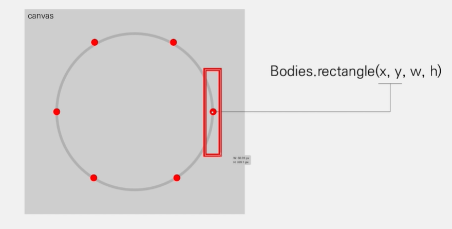

# MatterJS

- javascript용 2D 물리엔진
- 웹 기반 콘텐츠, 게임, 애니메이션 등에 사용
- 직접 구현하기 어려운 물리 알고리즘을 쉽게 사용가능

### Engine

- 물리 시뮬레이션 담당
- Body들의 list들을 관리
- Body 들의 위치, 속도 ,충돌 등을 계산

### Render

- Body들의 시각적인 부분을 담당
- Canvas

### Runner

- Engine, Render의 업데이트 loop관리
- requestAnimationFrame 같은.,

### Body

- 단일 물리적 객체 (시각적 x)
- 한 객체의 position, velocity, force, mass를 가짐

### Bodies

- 물리값만 가진 Body를 시각적으로 쉽게 표현하기 위한 모듈
- 원, 사각형 ,다각형 등 쉽게 제작

### Composite

- Composite.add(engin.world, [...body])
- world에 body를 추가해주는 역할
- 또는 body들을 하나로 묶는 그룹의 역할도 가능

### Mouse

- canvas내에서 마우스 포지션 값
- 그러나 Canvas의 body들고 상호작용 못함

### MouseContraint

- 각 Body들과 상호작용을 할 수 있게 해줌
- Mouse를 이 것과 연결하여 사용

### 알면 좋을 것들

- Bodies.rectangle(x, y, w, h) => x, y가 0일 때 좌측상단 기준으로 w, h 길이만큼 사각형이 만들어 지는 것이 아닌, 사각형의 정중앙 좌표가 0이다.

* 동그란 ground(이 프로젝에서 틀? 같은 느낌)는 MatterJS에서 지원하지 않음. 직접 구현해서 사용!
  - Bodies.circle이 있지 않냐? => 속이 꽉찬 골프공이라고 생각하면 된다. 동그란 틀이 필요한데 circle 안은 꽉찬 도형이므로 어떤 작업 추가 못함.
  * 다각형으로 원을 만들어준다.(출처: 패스트캠퍼스 인터렉티브 웹 캔버스 강의)
    

### 가시성 추가 IntersectionObserver

- root : observer 대상 가시성 여부를 위한 뷰포트, 기기의 viewport가 기본값,
- rootMargin : 뷰포트의 가시성 검증을 위한 영역을 확대/축소(css margin 비슷)
- threshold : 관측 대상의 몇 %가 보였을 때 intersecting 처리를 할지

```
 const options = {
  root : document.querySelector('#scrollAera),
  rootMargin : '0px',
  threshold : 1.0
 }

 const observer = new IntersectionObserver(callback, options);
```
